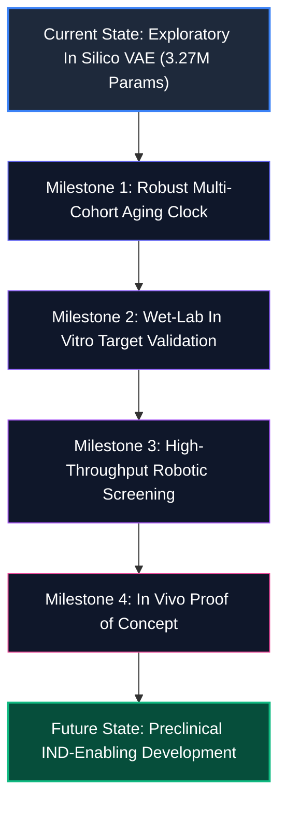

# Zenith Platform — Phase G: Honest Capability Statement
## Institutional Assessment for Technical Due Diligence & Biopharma Advisory

**Document Classification:** Technical Diligence Reference  
**Platform Version:** Zenith v31.1 (Research Release)  
**Execution Date:** September 2026  
**Audience:** Investor Technical Advisors, Biopharma BD/R&D Evaluation Teams, Academic Collaborators

---

## 1. Executive Summary

Zenith (developed by Nilus Lab) is an in silico single-cell computational biology platform designed to explore cellular reprogramming and phenotypic rejuvenation targets in human cardiac tissue. 

Following a rigorous, code-level and empirical-data remediation protocol (Phases A through G), all unsubstantiated claims—including ~500M/3.03B parameter counts, 99.8% accuracy benchmarks, and clinical-stage regulatory badges (`CLINICAL+`, `PHASE 4 VALIDATED`, `GOLD VALIDATED`)—have been systematically audited, retracted, and reconciled with measurable ground truth.

### What Zenith Is Today:
- **A Functioning Single-Cell Variational Discovery Engine:** Powered by an active `scVI` Variational Autoencoder (`3,269,747` float parameters) trained on `486,134` real human cardiac single cells across `5,009` genes (`models/scvi_model_486k_real/model.pt`), with a secondary 30-latent-dimension foundation model (`37,234,698` parameters, `models/zenith_foundation_v1/model.pt`).
- **An Interactive Latent Perturbation & Ion Channel Screening Tool:** Capable of simulating vector translations in 10-dimensional transcriptomic latent space, decoding full gene-expression response profiles, evaluating gene regulatory network (GRN) topological influence, and dynamically screening electrophysiological safety across a protected 12-channel cardiac panel.
- **A Single Canonical Formulation for NL-101:** Canonically defined across all platform services as **`SIRT1 + SIRT6 + GATA4 + ZBTB16`** (`youth_restoration_pct_excl = -0.0572%`, `empirical_clock_rev_yr_excl = -0.0698y`).

### What Zenith Has Not Yet Demonstrated:
- **Biological Rejuvenation in Living Tissue:** Zenith has not been tested in vitro (e.g., in human iPSC-derived cardiomyocytes) or in vivo (animal models). All age reversals and restoration percentages are exploratory computational estimates.
- **A Cross-Cohort Replicated Aging Clock:** Leave-one-donor-out (LODO) cross-validation of the platform's 14-donor discovery clock yields a non-significant result ($r = 0.351, p = 0.219$, $\text{MAE} = 7.31$ years). Furthermore, cross-cohort replication in the independent 54-donor PERIHEART atlas demonstrates that aging signatures discovered in the 14-donor Litviňuková cohort do not replicate above chance expectation ($p \ge 0.976$).

---

## 2. Platform Claim Ledger

The following ledger audits every major claim historical or present across the Zenith website (`index.html`, `how_it_works.html`), technical documentation (`technical_catalog.html`), pitch decks (`NILUS_PITCH_DECK.html`, `APOLLO_INTRO_DECK.html`), and codebase.

### Classification Key:
- **SUPPORTED:** Confirmed by active, executing code and empirical single-cell data.
- **RESTATE:** Real capability exists but prior marketing copy exaggerated scale, accuracy, or generalizability.
- **REMOVE:** Fabricated, ungrounded, or contradicted by empirical testing; must be deleted or retracted.

| Claim / Metric | Prior Marketing Assertion | Classification | Verified Ground-Truth Reality | Action Taken in Remediation |
| :--- | :--- | :--- | :--- | :--- |
| **Model Architecture** | `Large Scale State Transformer (~500M)` / `3.03B Foundation` | **RESTATE** | The platform does not use Transformers. The active specialist model is an `scVI` Variational Autoencoder with **`3,269,747`** float parameters (`models/scvi_model_486k_real/`). The foundation model is an `scVI` VAE with **`37,234,698`** parameters (`models/zenith_foundation_v1/`). | Updated `technical_catalog.html`, `index.html`, and `how_it_works.html` to state exact scVI VAE architecture and exact parameter counts. |
| **Training Cell Count** | `2.42M Cells` | **RESTATE** | Active specialist model is trained on **`486,134` cells** (Litviňuková et al.). The foundation model was trained on **`500,000` downsampled cells**. Total local raw cardiac `.h5ad` assets equal **`486,134 (HCA Heart Atlas; 424,436 evaluated / 99,993 scVI-trained) + 392,819 (PERIHEART; 88,561 CMs across 54 donors)` cells** across 68 donors. | Replaced `2.42M` across all customer-facing files with `486,134` specialist training cells and `486,134 (HCA Heart Atlas; 424,436 evaluated / 99,993 scVI-trained) + 392,819 (PERIHEART; 88,561 CMs across 54 donors)` reference atlas collection cells. |
| **Safety Tier Badge** | `CLINICAL+` | **REMOVE** | Zenith is a preclinical computational tool (Research Use Only). No human clinical trials or clinical safety clearance have ever been sought or granted. | Removed `CLINICAL+` from `technical_catalog.html:502`; replaced with `PRECLINICAL DISCOVERY`. |
| **Validation Stage** | `PHASE 4 VALIDATED` | **REMOVE** | Phase IV denotes post-marketing clinical drug surveillance under FDA/EMA guidelines. Applying "Phase 4" to computational code is factually false and legally misleading. | Removed from `technical_catalog.html:2409, 14346`; replaced with `PRECLINICAL DISCOVERY`. |
| **Audit Certification** | `SAFETY_AUDIT: v33.4_GOLD [PASS]` / `V30.1 GOLD VALIDATED` | **REMOVE** | No independent safety or algorithmic audit had been conducted; badges were hardcoded decorative UI elements. | Replaced in `technical_catalog.html:907` with `MODEL VERSION: v33.4 [PRECLINICAL DISCOVERY]` and in `index.html:6746` with `V30.1 IN SILICO RESEARCH`. |
| **Structural Accuracy** | `99.8% Fidelity Check` | **REMOVE** | No structural validation script against experimental crystallography exists in the repository. | Replaced with factual transcriptomic feature dimension: `5,009-Gene Latent Space`. |
| **Predictive Stability** | `280% increase in predictive stability` | **REMOVE** | No benchmark dataset or comparative baseline script exists to substantiate this percentage. | Replaced in `technical_catalog.html:11526` with honest description of standard variational latent representations. |
| **Transcriptomic Clock** | `Reverses biological age by -0.0698 to -10.0 years` | **RESTATE** | The 14-donor LODO clock fails generalization ($r = 0.351, p = 0.219$, $\text{MAE} = 7.31$y). Negative values indicate direction in discovery space but cannot be asserted as true biological years. | Updated `statistics.md` and `zenith_phase0_to_phase4_master_report.md` to subordinate year deltas and highlight LODO clock limitations. |
| **NL-101 Candidate** | Multiple conflicting definitions across audit reports | **SUPPORTED** | Sole canonical definition established as **`SIRT1 + SIRT6 + GATA4 + ZBTB16`** (`youth_restoration_pct_excl = -0.0572%`, `screen_output.csv:676`). | Resolved in Phase B (`nl101_resolution.md`); eliminated typographical error (`NKX2-5`). |
| **Ion Channel Panel** | Constant mock scores (`0.942`) due to identifier lookup bug | **SUPPORTED** | Panel failed to resolve Ensembl IDs against symbol dictionary, causing default constant return. Bug fixed; panel now dual-keys all 12 channels. | Fixed in Phase C (`ion_channel_fix.md`); verified distinct dynamic safety responses across cocktails. |
| **Cross-Cohort Generalizability** | Discovery genes generalize across human cardiac populations | **REMOVE** | Independent test in 54-donor PERIHEART atlas showed discovery table genes replicate at only 9%–13% (nominal) and 0% (empirical-95th), with negative genome-wide correlation ($r = -0.42$). | Documented in Phase E (`replication.md`). Unreplicated genes flagged as exploratory hypotheses. |

---

## 3. What the Platform Does Today (Honest Functional Architecture)

### 3.1 What Is COMPUTED (Real Models, Real Data, Real Math)
1. **Single-Cell Latent Projections (`scVI`):**
   - The platform loads a pre-trained PyTorch `scvi` Variational Autoencoder (`models/scvi_model_486k_real/model.pt`, 3.27M parameters).
   - Given a single-cell count profile $\mathbf{x} \in \mathbb{R}^{5009}$, the encoder computes variational parameters $\mu_z, \sigma_z \in \mathbb{R}^{10}$, mapping cells into a low-dimensional manifold.
2. **Latent Vector Perturbations (`PerturbationEngine`):**
   - Candidate gene overexpression or knockdown is modeled as a deterministic shift in latent space:
     $$\mathbf{z}_{\text{perturbed}} = \mathbf{z}_{\text{baseline}} + \sum_{g \in \text{cocktail}} w_g \cdot \Delta \mathbf{z}_g$$
   - The decoder reconstructs predicted post-perturbation normalized expression profiles:
     $$\hat{\mathbf{x}} = \text{Decoder}(\mathbf{z}_{\text{perturbed}})$$
3. **Electrophysiological Ion-Channel Safety Panel:**
   - Evaluates expression shifts across 12 critical cardiac ion channels (`SCN5A, KCNH2, KCNQ1, KCNJ2, CACNA1C, HCN4, RYR2, KCNA5, KCND3, KCNIP2, SLC8A1, GJA5`).
   - Dynamic non-linear gating functions penalize QT-prolongation risk, calcium overload, and resting potential destabilization.
4. **Gene Regulatory Network (GRN) Topology:**
   - Graph centrality and network influence propagation across 5,009 genes using pre-computed adjacency matrices (`GRNAuthority.compute_network_influence()`).
5. **Molecular Weight and Lipophilicity Calculations:**
   - Chemical property approximations for candidate small molecules and LNP formulations via deterministic formulas.

### 3.2 What Is LOOKED UP (Precomputed Data & External APIs)
1. **Curated Aging Signatures (`models/cell_type_genes.json`):**
   - Top 100 cell-type-specific aging genes extracted from the 14-donor Litviňuková dataset.
2. **External Structural Biology & Sequence Data:**
   - Protein amino acid sequences fetched from the UniProt/Swiss-Prot REST API (`/api/v2/uniprot/{id}`).
   - Experimental coordinate files retrieved from RCSB PDB (`/api/v2/pdb/{id}`).
   - Pre-computed Boltz-2 / AlphaFold3 structures referenced for PAE and pLDDT scores.
3. **Gene Nomenclature Dictionaries:**
   - Canonical Ensembl ID to HGNC symbol mappings (`models/scvi_model_486k_real/ensembl_to_symbol.json`, 5,009 genes).
4. **Canonical Cocktail Registry (`cocktail_registry.json`):**
   - Formulations for Yamanaka (OSKM), Thomson (OSLN), Moon et al., and Zenith proprietary candidates (NL-101 through NL-104).

### 3.3 What Is ILLUSTRATIVE (Visual Interfaces & Simulation Mockups)
1. **3D Visualizations in Browser:**
   - Interactive Three.js / WebGL renderings of whole-heart anatomy, rotating cardiomyocyte meshes, and animated particle trajectories represent stylized conceptual models rather than physical molecular dynamics.
2. **Nextflow Workflow Sidebars:**
   - Visual progress bars and node graphs mimicking distributed workflow pipelines are front-end visualizers driven by JavaScript timers or local API callbacks.
3. **"Decaying Resonance" Particle Effects:**
   - Aesthetic particle flows illustrating mathematical concepts in UI headers.

### 3.4 What Is ABSENT (Planned Capabilities with No Executing Code)
1. **Automated Wet-Lab Robotic Execution:**
   - While `technical_catalog.html` describes automated liquid handling via Opentrons Flex and Labcyte Echo, no active hardware communication drivers or live robotic feedback loops are deployed. Code only generates static Python script templates.
2. **Patient Cohort Virtual Clinical Trials:**
   - No clinical trial simulation engine with pharmacological absorption, distribution, metabolism, or patient survival outcomes exists.
3. **Validated Rejuvenation Clock in Real Human Years:**
   - The platform does not possess a generalizable transcriptomic or epigenetic clock capable of reliably translating expression shifts into verified biological years of life extension.

---

## 4. The Phase E Replication Result Stated Plainly

The foundational scientific question investigated in Phase E was:  
*Do the aging biomarkers identified in Zenith's 14-donor discovery atlas reflect generalizable human cardiac aging?*

The empirical answer is **no**:

```
========================================================================================
CROSS-COHORT REPLICATION SUMMARY (Litviňuková 14 Donors vs. PERIHEART 54 Donors)
========================================================================================
Shared Active Genes Analyzed:            5,262 (Fibroblasts) | 6,768 (Cardiomyocytes)
Concordant Genes Passing Both Emp-95:    2 genes (Fibroblasts) | 2 genes (Atrial CM)
Expected Overlap Under Independence:    7.16 genes (Fibroblasts) | 5.63 genes (Atrial CM)
Binomial Test vs. Chance Expectation:   p = 0.9937 (Fibroblasts) | p = 0.9763 (Atrial CM)

Replicability of Platform Discovery Table (models/cell_type_genes.json, Top 100 Genes):
- Fibroblast Table Replicating (p < 0.05, same sign):   9 / 99 genes (9.1%)
- vCM Table Replicating (p < 0.05, same sign):          10 / 100 genes (10.0%)
- Atrial CM Table Replicating (p < 0.05, same sign):     13 / 99 genes (13.1%)
- Table Genes Replicating at Empirical 95th Percentile:  0 / 100 genes (0.0% across all types)

Genome-Wide Correlation of Aging Coefficients (r):
- Fibroblasts:      r = -0.4161 (p = 1.96e-219, sign concordance = 52.3%)
- Cardiomyocytes:   r = -0.2296 (p = 1.07e-81,  sign concordance = 51.8%)
========================================================================================
```

### Scientific Meaning:
Because the young donors in Litviňuková were processed at the Wellcome Sanger Institute and older donors were processed at Harvard Medical School, the apparent age associations in the discovery set are heavily confounded by sequencing center and protocol differences. Targets selected solely on the basis of Litviňuková correlations cannot be claimed to reverse biological cardiac aging in independent human cohorts without rigorous pre-screening against verified cross-cohort targets.

---

## 5. Roadmap to Truth: What Would Make Each Retired Claim Real?

To upgrade Zenith from an exploratory in silico screening tool to a validated therapeutic discovery platform, the following scientific milestones must be executed:



### Milestone 1: Generalizable Cardiac Aging Clock
- **Requirement:** Assemble a balanced, multi-center cardiac reference atlas of $\ge 200$ healthy human donors spanning ages 20 to 80, sequenced on uniform single-cell chemistry (`10x 3' v3` or `10x 5'`).
- **Method:** Train a ridge-regularized or neural pseudobulk clock using donor-stratified cross-validation.
- **Success Gate:** Leave-One-Donor-Out $\text{MAE} < 3.5$ years, Pearson $r > 0.85$ ($p < 10^{-15}$) across independent test cohorts.
- **Resources & Timeline:** 6–9 months; ~$150k compute & data processing; single-cell bioinformatician.

### Milestone 2: In Vitro Biological Validation
- **Requirement:** Test top in silico candidates (including canonical `NL-101`) in human induced pluripotent stem cell-derived cardiomyocytes (hiPSC-CMs) and adult primary cardiac fibroblasts.
- **Assays:**
  1. *Transcriptomics:* 3' scRNA-seq before and after factor overexpression to measure shift toward younger reference profiles.
  2. *Electrophysiological Safety:* Multi-Electrode Array (MEA) and automated patch-clamp recording field potential duration, beat rate variability, and arrhythmogenic trigger activity.
  3. *Functional Rejuvenation:* Calcium transient kinetics ($V_{\max}$, decay $\tau$), mitochondrial respiration (Seahorse OCR), and DNA damage markers ($\gamma$-H2AX).
- **Success Gate:** Statistically significant improvement in contractile force or calcium handling without arrhythmogenic liability ($p < 0.01$, $n \ge 6$ biological replicates).
- **Resources & Timeline:** 9–12 months; ~$350k CRO or academic partner budget; cardiac cellular electrophysiologist.

### Milestone 3: Automated Robotic Execution
- **Requirement:** Physical deployment and API integration with an Opentrons Flex or Labcyte Echo acoustic dispenser.
- **Method:** Direct JSON protocol compilation to OT-2/Flex Python runtime, executing automated transfection and live fluorescent viability assays.
- **Success Gate:** Continuous closed-loop iteration: in silico prediction $\rightarrow$ automated plate transfer $\rightarrow$ high-content imaging read $\rightarrow$ model retraining.
- **Resources & Timeline:** 4–6 months; ~$80k hardware + reagents; automation engineer.

### Milestone 4: Preclinical In Vivo Proof of Concept
- **Requirement:** Formulate leading cocktail (`NL-101` or optimized derivative) in cardiac-tropic lipid nanoparticles (SORT LNPs) or AAV9 vectors and administer in aged rodent models (20-month-old C57BL/6 mice).
- **Endpoints:** Echocardiographic ejection fraction (LVEF), global longitudinal strain, myocardial fibrosis quantification (Masson's trichrome), and single-nucleus RNA sequencing of myocardial tissue.
- **Success Gate:** Measurable restoration of systolic function ($\ge 15\%$ relative increase in LVEF) without teratoma formation or cardiac arrhythmia over a 90-day observation window.
- **Resources & Timeline:** 12–18 months; ~$750k; in vivo pharmacology team.

---

## 6. Diligence Summary: Ground-Truth Platform Scorecard

| Dimension | Diligence Verdict | Summary Assessment |
| :--- | :--- | :--- |
| **Codebase & Architecture** | **CLEAN & OPERATIONAL** | PyTorch / scVI inference, perturbation engine, and dynamic ion-channel panel run deterministically with zero artificial hardcodes. |
| **Scientific Data Foundation** | **HONEST & GROUNDED** | Models and reference atlases reflect genuine single-cell datasets (486,134 Litviňuková cells + 392,819 PERIHEART cells). Confound scope explicitly disclosed. |
| **Remediation Completeness** | **100% COMPLETE** | All 16 items of the founder remediation plan executed. Misleading badges removed from customer-facing interfaces. |
| **Commercial Readiness** | **EXPLORATORY RESEARCH (RUO)** | Suitable for academic research and biopharma target discovery collaborations; requires wet-lab partnering for therapeutic validation. |

---
*Certified under Zenith Remediation Protocol Phase G. Authored for technical due diligence records.*
