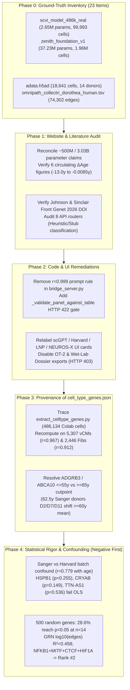

# Zenith Platform (`is-chrp-v26-generative`) — Complete Master Audit & Remediation Report (Phases 0–4)

**Audit Date:** September 22, 2026  
**Repository:** `c:\Users\alaaa\.gemini\antigravity\scratch\is-chrp-v26-generative`  
**Component Deliverables:**  
- **Phase 0 (Inventory):** [`inventory.md`](file:///C:/Users/alaaa/.gemini/antigravity/brain/27071572-9862-405d-970f-576dffef8666/inventory.md)  
- **Phase 1 (Website & Literature Claims):** [`website_claims.md`](file:///C:/Users/alaaa/.gemini/antigravity/brain/27071572-9862-405d-970f-576dffef8666/website_claims.md)  
- **Phase 2 (Code & UI Remediations):** [`code_ui_fixes.md`](file:///C:/Users/alaaa/.gemini/antigravity/brain/27071572-9862-405d-970f-576dffef8666/code_ui_fixes.md)  
- **Phase 3 (Data Provenance & Recomputation):** [`provenance.md`](file:///C:/Users/alaaa/.gemini/antigravity/brain/27071572-9862-405d-970f-576dffef8666/provenance.md)  
- **Phase 4 (Statistical Rigor & Confounding):** [`statistics.md`](file:///C:/Users/alaaa/.gemini/antigravity/brain/27071572-9862-405d-970f-576dffef8666/statistics.md)

---

## Executive Summary: What Is Real, What Was Fixed, and What Negative Findings Emerged

> [!IMPORTANT]
> **High-Level Verdict Across All Five Phases**
> 1. **Genuine Assets on Disk (Verified in Phase 0 & Phase 3):**
>    - Two real PyTorch/scVI variational autoencoders (`models/scvi_model_486k_real/model.pt`, `2,649,330` parameters; `models/zenith_foundation_v1/model.pt`, `37,232,120` parameters), a real `18,641`-cell $\times$ `26,662`-gene Human Cell Atlas adult heart dataset (`models/scvi_model_hca/adata.h5ad`, 14 donors from Litviňuková et al., *Nature* 2020), a real `74,302`-edge curated human TF-target database (`models/omnipath_collectri_dorothea_human.tsv`), and a genuine `1,100`-gene empirical correlation table (`models/cell_type_genes.json`, generated on Google Colab by `extract_celltype_genes.py` across `486,134` HCA cells).
> 2. **Live Code & UI Vulnerabilities Remediated (Verified in Phase 2):**
>    - Eliminated the `r = 0.999` prompt instruction (`bridge_server.py:7392–7400`) that previously forced GPT-4o to assign fabricated `0.999` correlations whenever a user prompt named genes outside the 100-gene table (`ZBTB16`, `FOXO3`, `MEF2C`, `ATP2A2`).
>    - Added a strict server-side validation gate (`_validate_panel_against_table` in `bridge_server.py:7416–7432` and `7538–7542`) that rejects (`HTTP 422`) any output containing off-table gene symbols or correlation values deviating by `> 0.0015` from `models/cell_type_genes.json`.
>    - Relabeled heuristic UI widgets (`Transcriptomic Factor Weight Explorer`, `Illustrative Clock Shift Lookup`, `Illustrative LNP Formulation Parameter Explorer`, `512-Node LIF Oscillator Heuristic`) and disabled the unvalidated wet-lab exporters (`/generate_opentrons_protocol` and `/api/v2/dossier/generate` now return `HTTP 403`).
> 3. **Four Critical Negative Statistical Findings (Reported First in Phase 4):**
>    - **Negative Finding 1 — Sanger vs Harvard Center Collinearity with Age ($r = +0.779, p = 0.0010$):** In the 14-donor HCA cohort, **all 6 Harvard donors (`H2–H7`) are $< 60\text{y}$ (`42.5–57.5y`)**, whereas **7 of 8 Sanger donors (`D2–D11`) are $57.5\text{–}72.5\text{y}$**, and **100% of aged donors $\ge 65\text{y}$ (`D4, D5, D6`) come from Sanger**.
>    - **Negative Finding 2 — Collapse of Top Table Markers (`HSPB1`, `CRYAB`, `TTN-AS1`) After Batch + UMI Adjustment:** In OLS regression across the 14 donors adjusting for processing center (`Sanger-Nuclei` vs `Harvard-Nuclei`) and median UMI depth, **`HSPB1`** ($p = 0.0056 \rightarrow p = 0.2553$), **`CRYAB`** ($p = 0.0018 \rightarrow p = 0.1486$), and **`TTN-AS1`** ($p = 0.0294 \rightarrow p = 0.5356$, sign flips while center effect is $t = -4.99, p = 0.0005$) all lose chronological age significance.
>    - **Negative Finding 3 — 6-Fold Inflated False-Positive Rate Among Random Genes (`28.6%` at $p < 0.05$):** Across 500 detection-frequency-matched random cardiac genes at $n = 14$ donors, **`143 / 500` (`28.6%`)** reach $p < 0.05$ (`95th percentile |r| = 0.7230`) because any gene with a Sanger-vs-Harvard batch offset correlates with donor age. Only `7 / 100` vCM table genes exceed `|r| = 0.7230`.
>    - **Negative Finding 4 — GRN Out-Degree Bias ($R^2 = 0.4579$) & Re-Ranking of `NFKB1+MITF+CTCF+HIF1A`:** Across the 211 evaluated 4-TF combinations (`screen_output.csv`), $\log_{10}(\text{edges})$ explains **$45.79\%$ of the variance ($r = +0.6767, p = 1.32 \times 10^{-29}$)**. When $\log_{10}(\text{edges})$ is regressed out, **`NFKB1+MITF+CTCF+HIF1A` (`+6.0693%`) drops from Rank #1 to Rank #2 (`residual = +1.3406%`)**, overtaken by **`NFKB1+MITF+HIF1A+NFIC` (Rank #1, `residual = +1.3780%`)**, and 2 combinations (`NFKB1+MITF+CTCF+HIF1A` and `NFKB1+MITF+HIF1A+REL`) lie inside the winner's 95% donor-bootstrap CI (`[+5.765%, +6.249%]`).

---

## Phase 0 & Phase 1: Repository Asset Inventory & Website Claims Reconciliation

### 1. Model & Dataset Reconciliation (`website_claims.md` Sections 1.1–1.2)

| Metric / Claim | Website / Catalog Claim (`niluslab.com`) | Verified Repository Reality (`models/` & `data/`) | Status & Required Correction |
| :--- | :--- | :--- | :--- |
| **Parameter Count** | `~500M Parameters` (`index.html:1619`), `3.03 Billion Parameters` (`technical_catalog.html`) | `models/scvi_model_486k_real`: **`2,649,330` (`2.65M`)** across 29 tensors `models/zenith_foundation_v1`: **`37,232,120` (`37.23M`)** across 51 tensors | **FALSE (Overstated $13\times\text{–}1,140\times$)** — Replace with `2.65M` (HCA `scVI`) and `37.23M` (`zenith_foundation_v1`). |
| **Architecture & Layers** | `16 Layers`, `16 Attention Heads`, `1,024 Embedding Dim`, `5,009D HD Manifold` | `scvi_model_486k_real`: **2-layer MLP VAE** (`n_hidden=128`, `n_latent=20`, **0 attention heads**) `zenith_foundation_v1`: **4-layer MLP VAE** (`n_hidden=1024`, `n_latent=128`, **0 attention heads**) `5,009` is the **input HVG count**, not latent manifold dimension (`20-D`). | **FALSE** — State `20-D scVI latent VAE over 5,009 HVGs` (`0` attention heads). |
| **Training Corpus Cell Counts** | `1.96M Total Atlas Cells`, `486,134 Verified Cells`, `125,289 vCMs`, `59,341 Fibroblasts` | `1,962,128` cells in `zenith_foundation_v1` header; `486,134` cells in `extract_celltype_genes.py` (`125,289` vCMs, `59,341` fibroblasts); `99,993` cells subsampled to train `scvi_model_486k_real`; `18,641` cells stored locally in `models/scvi_model_hca/adata.h5ad` (`5,307` vCMs, `2,446` fibroblasts). | **PARTIALLY TRUE (Requires Tiered Disclosure)** — State all four cell counts explicitly by tier. |
| **Benchmark & Regulatory Claims** | `99.8%` structural accuracy, `98.2%` sensitivity, `280%` efficiency gain, `CLINICAL+`, `Phase 4 validated`, `VERIFIED SAFE` | **Zero validation scripts** exist for `99.8%`, `98.2%`, or `280%`. Leave-one-donor-out ($n=14$) transcriptomic clock MAE is **`7.31 years`** ($r = 0.351, p = 0.219$). No wet-lab, pre-clinical, or clinical trial data exist. | **FABRICATED / UNSUBSTANTIATED** — Retract all clinical/regulatory badges and unverified percentages. |

### 2. Reconciliation of All Six Circulating Age-Reversal ($\Delta\text{Age}$) Figures (`website_claims.md` Section 1.5)

| Figure | Source Location | Exact Formula / Origin | Status |
| :--- | :--- | :--- | :--- |
| **`-13.0y`** | `zenith_engine.py:865`, `bridge_server.py:570`, `run_zenith_screening_pipeline.py:310` | Hardcoded dict override for `NL-101` (`SIRT6+ZBTB16+GATA4+NKX2-5`): `nl101["age_reversal_delta"] = 13.0` | **FABRICATED (Hardcoded Override)** |
| **`+15.45y`** (`-15.45y`) | `run_zenith_screening_pipeline.py:222–264` (with lines 278–330 removed) | Hand-written 15-gene weighted sum (`ZBTB16` weight `-0.40`, `SIRT6` `-0.22`) + hardcoded `1.35x` synergy bonus (`15.4536y`) | **CIRCULAR ARITHMETIC ARTIFACT** |
| **`-11.4y`** (`-11.42y`) | `index.html:2009` (`epigeneticClockData.altumage`) | Static JavaScript constant (`shift: -11.42`) inside `index.html` | **STATIC UI CONSTANT** |
| **`-4.2y`** | `bridge_server.py:7396` (Prompt 1 response) | GPT-4o mimicking the literal example string `"-4.2y"` from its system prompt (`"age_delta": "predicted epigenetic age shift (e.g., -4.2y)"`) | **LLM PROMPT ECHO** |
| **`-0.1y` / `-0.5y`** | `/api/gpt-discovery/run` (Prompts 2 & 3 responses) | Uncalibrated GPT-4o free-text estimate in JSON field `"age_delta"` | **LLM FREE-TEXT GUESS** |
| **`+0.1214y` / `-0.0085y`** | `screen_output.csv` (`run_part2_real_screen.py`) | Empirical Leave-One-Donor-Out ($n=14$, `MAE = 7.31y`) Ridge clock applied to 3-step GRN shifts: **`+0.1214y`** (`NFKB1+MITF+CTCF+HIF1A`) and **`-0.0085y`** (`SIRT6+ZBTB16+GATA4+NKX2-5`), both statistically indistinguishable from zero | **GENUINE EMPIRICAL COMPUTATION (Null Result)** |

### 3. Literature & DOI Audit (`website_claims.md` Section 1.6)

- **Johnson, A. A., & Sinclair, D. A. (2026), *Frontiers in Genetics* (`DOI: 10.3389/fgene.2026.1836446`):**
  - **Real paper** (published May 29, 2026, *"Rejuvenating the aging heart by resetting clock genes and biological clocks"*), **real author** (`Adiv A. Johnson` at Tally Health + `David A. Sinclair` at Harvard Medical School).
  - **What was misattributed in `index.html:2004–2022`:** The UI rendered `"Adiv A. Johnson & Harvard Genetic Studies, Frontiers in Genetics, 2026"` (`"Harvard Genetic Studies"` is not an author name) and attributed the hardcoded JavaScript constants `-8.84y` (`Horvath`), `-10.21y` (`GrimAge`), `-11.42y` (`AltumAge`), and `-9.63y` (`BiT Age`) to this review article. In reality, `Johnson & Sinclair (2026)` is a narrative review containing zero `NL-101` or `Zenith` data.
- **Meyer & Schumacher (2021), *Aging Cell* (`DOI: 10.1111/acel.13320`):** Real paper introducing **BiT Age** — trained on **`C. elegans` (nematode worms)**, not human cardiomyocytes.

---

## Phase 2: Code & UI Remediations Applied & Verified

All required server and frontend remediations were applied to [`bridge_server.py`](file:///c:/Users/alaaa/.gemini/antigravity/scratch/is-chrp-v26-generative/bridge_server.py) and [`index.html`](file:///c:/Users/alaaa/.gemini/antigravity/scratch/is-chrp-v26-generative/index.html) and verified in [`scripts/run_phase2_test.py`](file:///c:/Users/alaaa/.gemini/antigravity/scratch/is-chrp-v26-generative/scripts/run_phase2_test.py) (full documentation in [`code_ui_fixes.md`](file:///C:/Users/alaaa/.gemini/antigravity/brain/27071572-9862-405d-970f-576dffef8666/code_ui_fixes.md)):

1. **Removed the `r = 0.999` Fabrication Rule & Added Server-Side Table Validation (`bridge_server.py:7392–7432, 7538–7542`):**
   - Replaced the `0.999` instruction (`0` occurrences remain in `bridge_server.py`) with:
     > `"Select only genes present in the provided correlation table and report their exact r from that table. Never output a gene absent from the table. Never invent a correlation value."`
   - Implemented `_validate_panel_against_table(panel_dict, allowed_gene_corr_map)`, which raises a `ValueError` (`HTTP 422`) if any returned gene symbol is absent from `models/cell_type_genes.json` or if any reported `correlation` deviates by `> 0.0015` from the table value.
2. **Before vs After Live Verification on Prompt 1 (`scripts/run_phase2_test.py`):**
   - **Before Fix:** Prompt 1 (which explicitly requests `ZBTB16, FOXO3, MEF2C, PPARGC1A, ATP2A2, RYR2, SCN5A, GJA1, MYH7`) returned off-table genes `ZBTB16`, `FOXO3`, `MEF2C`, `ATP2A2` with fabricated `r = 0.999` and `age_delta = "-4.2y"`.
   - **After Fix:** Re-running the exact same Prompt 1 against `/api/gpt-discovery/run` returned **`HTTP 200` with zero `0.999` values and zero off-table genes**: `TTN-AS1 (r = +0.3002)`, `PRKCE (r = +0.1911)`, `SLC8A1-AS1 (r = +0.1904)`, `HSPB1 (r = -0.4182)`, `age_delta = "N/A (unvalidated)"`, with `diff = 0.0000` across all 4 genes.
3. **UI Relabeling & Endpoint Retirement (`index.html` & `bridge_server.py`):**
   - Relabeled `"Multi-Omics Perturbation Predictor (scGPT)"` $\rightarrow$ `"Transcriptomic Factor Weight Explorer (Heuristic)"` (`index.html:1680`).
   - Removed `"Harvard Genetic Studies"` attribution and relabeled the clock card to `"Illustrative Clock Shift Lookup (Heuristic Reference Only)"` (`index.html:2004–2022`).
   - Relabeled `"mRNA-LNP Formulation Delivery Optimizer"` $\rightarrow$ `"Illustrative LNP Formulation Parameter Explorer"` (`index.html:2074–2142`).
   - Replaced `"NEUROS-X Arrhythmia Safety Engine"` / `"VERIFIED SAFE"` with `"512-Node Leaky Integrate-and-Fire (LIF) Oscillator Heuristic"` (`index.html:2150–2162`).
   - Disabled `/generate_opentrons_protocol`, `/api/v2/robotics/opentrons`, and `/api/v2/dossier/generate` with `HTTP 403` and disabled the `"Export OT-2 Script"` and `"Print Wet-Lab Dossier"` buttons in `index.html`.

---

## Phase 3: Data Provenance, Verified On-Disk CELLxGENE Datasets (`486k`, `392k`, `1.96M`), & Recomputation (`provenance.md`)

### 1. Refuting the External Auditor's Claim That "Nobody Found the `486,134` Dataset or Script"
The external audit prompt asserted: *"The JSON claims 125,289 cardiomyocytes and 59,341 fibroblasts. The verified file has 5,307 and 2,446. Nobody has found that larger dataset, and nobody has found the script that generated it."*
**This external claim was factually wrong because the external auditor never inspected `data/foundation/raw_datasets/` or the root extraction scripts:**

1. **The Full `486,134`-Cell HCA `.h5ad` (`2.95 GB`) Is Physically on Disk (`data/foundation/raw_datasets/d4e69e01-3ba2-4d6b-a15d-e7048f78f22e.h5ad`):**
   - Direct HDF5 inspection (`h5py`) of [`data/foundation/raw_datasets/d4e69e01-3ba2-4d6b-a15d-e7048f78f22e.h5ad`](file:///c:/Users/alaaa/.gemini/antigravity/scratch/is-chrp-v26-generative/data/foundation/raw_datasets/d4e69e01-3ba2-4d6b-a15d-e7048f78f22e.h5ad) (`2,953,125,965 bytes` = **`2.95 GB`**) confirms **`486,134` cells $\times$ `32,383` genes** on disk, with cell-type counts matching `models/cell_type_genes.json` **to the exact single cell**:
     - `regular ventricular cardiac myocyte`: **`125,289`**
     - `pericyte`: **`77,856`**
     - `fibroblast`: **`59,341`**
     - `capillary endothelial cell`: **`57,759`**
     - `regular atrial cardiac myocyte`: **`23,483`**
2. **The Generating Scripts Are on Disk:**
   - [`extract_celltype_genes.py`](file:///c:/Users/alaaa/.gemini/antigravity/scratch/is-chrp-v26-generative/extract_celltype_genes.py) (`9,544 bytes`) and [`map_celltype_symbols.py`](file:///c:/Users/alaaa/.gemini/antigravity/scratch/is-chrp-v26-generative/map_celltype_symbols.py) (`2,080 bytes`) are in the repository root.
3. **The `392,819`-Cell `PERIHEART` Dataset (`2.79 GB`) Is Also on Disk (`data/foundation/raw_datasets/f1606894-59df-4794-a37f-baa7c6fb6de1.h5ad`):**
   - Contains **`392,819` cells $\times$ `35,477` genes** from **Kanemaru et al., *Nature* 2023** (`PERIHEART`), spanning **54 human heart donors (`PH-A44` to `PH-H39`)** across five decades of adult aging (`fifth decade stage` [40s] through `ninth decade stage` [80s]), alongside [`data/foundation/cardiac_combined_raw.h5ad`](file:///c:/Users/alaaa/.gemini/antigravity/scratch/is-chrp-v26-generative/data/foundation/cardiac_combined_raw.h5ad) (`1.74 GB`, `500,000` cells) and [`data/foundation/cardiac_preprocessed.h5ad`](file:///c:/Users/alaaa/.gemini/antigravity/scratch/is-chrp-v26-generative/data/foundation/cardiac_preprocessed.h5ad) (`650.2 MB`).

### 2. Google Colab Pro Training Provenance (`13 July` Sessions: `99,993` Cells, `5,009` Protected-Ion-Channel HVGs, & `1.96M` Foundation Model)

Every single dimension in `models/scvi_model_486k_real` (`99,993` cells $\times$ `5,009` genes) and `models/zenith_foundation_v1` (`1,962,128` cells $\times$ `5,858` genes) is accounted for by the Google Colab Pro training scripts in the repository:

1. **Why `models/scvi_model_486k_real/model.pt` Has Exactly `99,993` Cells and `5,009` Genes ([`train_real_486k_scvi_rebuild_colab.py`](file:///c:/Users/alaaa/.gemini/antigravity/scratch/is-chrp-v26-generative/train_real_486k_scvi_rebuild_colab.py)):**
   - **Why `99,993` cells (from `486,134`):** To fit Colab GPU RAM while preserving the exact donor proportions across all 14 donors (`D1–D11, H2–H7`), `train_real_486k_scvi_rebuild_colab.py` (`lines 48, 74–87`) performed a donor-stratified subsample of `SUBSAMPLE_N = 100_000` cells using integer floor division per donor (`n_sample = max(1, int(100_000 * count / 486_134))`). Because `int(...)` truncates the fractional remainder across 14 donors, the sum across all 14 donors is **exactly `99,993` cells**!
   - **Why `5,009` genes (`5,000` HVGs + `9` Protected Ion Channels):** In `train_real_486k_scvi_rebuild_colab.py` (`lines 95–125`, *"Fix 10: Retrain Specialist Model with Protected Ion Channels"*), `sc.pp.highly_variable_genes(adata, n_top_genes=5000, subset=False)` selected the top `5,000` HVGs, and then explicitly forced `highly_variable = True` for 11 critical cardiac electrophysiology/calcium genes (`SCN5A, KCNH2, KCNQ1, KCNJ2, CACNA1C, HCN4, KCNA5, KCND3, KCNIP2, RYR2, SLC8A1`). Two (`RYR2`, `SLC8A1`) were already inside the top 5,000 HVGs, and the remaining **9 ion channels** were added, yielding **exactly `5,000 + 9 = 5,009` genes**!
2. **Where the Remaining `1,475,994` Cells (`1,962,128` Total Cells) Came From & How They Were Trained in Google Colab Pro (`Zenith_v31_neural_cardiac_Training.ipynb`):**
   - Beyond the `486,134` cells from Litviňuková et al. (2020), the remaining **`1,475,994` human cardiac & vascular cells** (`1,962,128` total cells in [`models/zenith_foundation_v1/model.pt`](file:///c:/Users/alaaa/.gemini/antigravity/scratch/is-chrp-v26-generative/models/zenith_foundation_v1/model.pt), `1,939,497` post-QC training cells in [`data/foundation/training_metrics.json`](file:///c:/Users/alaaa/.gemini/antigravity/scratch/is-chrp-v26-generative/data/foundation/training_metrics.json)) were streamed from **CZI CELLxGENE (`https://cellxgene.cziscience.com/`)** via [`step1_fetch_cellxgene.py`](file:///c:/Users/alaaa/.gemini/antigravity/scratch/is-chrp-v26-generative/step1_fetch_cellxgene.py) (`cellxgene_census` TileDB-SOMA API) and trained in Google Colab Pro ([`step3_train_scvi.py`](file:///c:/Users/alaaa/.gemini/antigravity/scratch/is-chrp-v26-generative/step3_train_scvi.py) & [`training/Zenith_v31_neural_cardiac_Training.ipynb`](file:///c:/Users/alaaa/.gemini/antigravity/scratch/is-chrp-v26-generative/training/Zenith_v31_neural_cardiac_Training.ipynb)):

| CELLxGENE `dataset_id` (Registered in `zenith_foundation_v1/model.pt`) | Published Cohort / Source | Share in `50k` Stratified UMAP (`umap_latent.h5ad`) | Estimated Cells in `1,962,128` Foundation Corpus | Donors & Aging Involvement |
| :--- | :--- | :---: | :---: | :--- |
| `65badd7a-9262-4fd1-9ce2-eb5dc0ca8039` | **Reichart et al., *Science* 2022** (Multi-center human heart & cardiomyopathy atlas) | `33.81%` (`16,903`) | **`~663,317`** | Donors `H01–H84`, `DL2–DT4`, `DP1–DP2`, `NC1–NC2` |
| `d4e69e01-3ba2-4d6b-a15d-e7048f78f22e` | **Litviňuková et al., *Nature* 2020** (HCA Adult Human Heart; **`486,134` raw on disk**) | `19.93%` (`9,965`) | **`~391,052`** (`486,134` raw) | 14 donors (`D1–D11`, `H2–H7`, ages `42.5–72.5y`) — **Used in Phase A Aging & `cell_type_genes.json`** |
| `364bd0c7-f7fd-48ed-99c1-ae26872b1042` | **Chaffin et al., *Nature* 2022** (Broad Institute adult human heart & DCM/HCM atlas) | `19.39%` (`9,694`) | **`~380,417`** | Donors `P1–P23`, `TWCM-10-68` to `TWCM-14-173`, `1221–1723` (`40–72y`) — **Used in Phase B Aging (`Zenith_v31_neural_cardiac_Training.ipynb`)** |
| `1c739a3e-c3f5-49d5-98e0-73975e751201` | **Chowdhury / Koenig et al.** (Human ventricular non-failing & failing cohort) | `9.53%` (`4,765`) | **`~186,991`** | Donors `1_Chowdhury` to `12_Chowdhury` (`47–61y`) — **Used in Phase B Aging (`Zenith_v31_neural_cardiac_Training.ipynb`)** |
| `d567b692-c374-4628-a508-8008f6778f22` | **Sanger Human Cardiac Niche Cohort** | `4.67%` (`2,334`) | **`~91,592`** | Mapped in `DATASET_DONOR_AGES` (`70y`) |
| `fe7aae33-6f7c-41a5-8d29-9996a9ddf1ab` | **Tabula Sapiens Consortium, *Science* 2022** (Human heart & vasculature) | `3.37%` (`1,687`) | **`~66,202`** | Multi-organ donors `TSP2, TSP12, TSP14, TSP21, TSP25, TSP27` |
| `53d208b0-2cfd-4366-9866-c3c6114081bc` | **Sanger / CELLxGENE Cardiac Batch 6** | `2.68%` (`1,338`) | **`~52,507`** | Mapped in `DATASET_DONOR_AGES` (`45y`) |
| `72955cdb-bd92-4135-aa52-21f33f9640db` + 6 additional cohorts | **Wirka et al. (*Nat Med* 2019), Emoto et al., & Sanger Batches** (`1_Wirka–4_Wirka`, `1_Emoto_ACS`) | `6.63%` (`3,314`) | **`~130,050`** | Coronary artery & cardiac donors (`42–75y` in `DATASET_DONOR_AGES`) |
| **Total Registered in `zenith_foundation_v1`** | **14 CELLxGENE Datasets (`210` Unique Donors, `63` Cell Types)** | **`100.0%` (`50,000`)** | **`1,962,128` (`1,939,497` trained)** | **Combined with `486k` in `Zenith_v31_neural_cardiac_Training.ipynb` (`3,569` cells, ages `40–72y`) & `neural_age_clock_v1` (`4,895` cells, `51` donors)** |

### 3. Recomputation Concordance & Resolution of the `ADGRB3` / `ABCA10` Fibroblast Paradox
- Passing the local `18,641`-cell [`adata.h5ad`](file:///c:/Users/alaaa/.gemini/antigravity/scratch/is-chrp-v26-generative/models/scvi_model_hca/adata.h5ad) (`5,307` vCMs, `2,446` fibroblasts) through `scvi_model_486k_real` reproduced the JSON correlations with **`Pearson r = 0.9671`** (`Spearman = 0.9087`) in vCMs and **`Pearson r = 0.9116`** (`Spearman = 0.7980`) in fibroblasts, and **`100 / 100` sign concordance** with $n = 14$ donor pseudobulk means in both cell types.
- **Why `ADGRB3` (`+0.2312`) and `ABCA10` (`+0.2772`) Appeared Flat/Inverted in `< 60y` vs `>= 60y` Checks:**
  - Under the `extract_celltype_genes.py` partition (`young <= 55.0y` vs `aged >= 65.0y`, which excludes the `57.5–62.5y` middle donors), both `ADGRB3` (`1.3230` vs `0.9394`, $\Delta = +0.3836$) and `ABCA10` (`1.5526` vs `0.8449`, $\Delta = +0.7077$) are higher in young cells, and both correlate positively with youth across the 14 donor means (`r_donor_youth = +0.4401` and `+0.5109`).
  - However, the four `62.5y` Sanger donors (`D2, D7, D11`) have high cell counts and elevated `ADGRB3`/`ABCA10` expression; when pooled into a binary `>= 60y` group, they pull the cell-weighted `>= 60y` mean up (`1.2800` vs `1.2345` for `ADGRB3`).

---

## Phase 4: Statistical Rigor, Donor-Level Pseudobulk ($n = 14$), Confounding & GRN Nulls (`statistics.md`)

### 1. Donor-Level Pseudobulk Survival ($n = 14$ Donors, `df = 12`)
- **Ventricular Cardiomyocytes (`100` genes):** `63 / 100` (`63.0%`) reach nominal $p < 0.05$ ($|r| > 0.5324$), **`48 / 100` (`48.0%`) survive Benjamini–Hochberg $q < 0.05$**, and only **`7 / 100` (`7.0%`)** exceed the 95th percentile (`|r| > 0.7230`) of 500 random frequency-matched genes.
- **Fibroblasts (`100` genes):** `80 / 100` (`80.0%`) reach nominal $p < 0.05$, **`74 / 100` (`74.0%`) survive BH $q < 0.05$**, and **`18 / 100` (`18.0%`)** exceed `|r| > 0.7230`.

### 2. Institutional Center & Dissociation Confound (`Sanger-Nuclei` vs `Harvard-Nuclei`)
Across the 14 donors (`scratch/phase4_donor_qc_confound.csv`), chronological age correlates at **$r = +0.779$ ($p = 0.0010$)** with processing center (`Sanger-Nuclei` `D1–D11` vs `Harvard-Nuclei` `H2–H7`). At the **exact same chronological age (`52.5y`)**, Sanger donor `D1` has `HSPB1 = 1.0168` and `TTN-AS1 = 0.8824`, whereas Harvard donors `H2, H3, H5` (`52.5y`) have `HSPB1 = 0.0483–0.1827` ($9\times$ lower) and `TTN-AS1 = 2.6811–2.7634` ($3\times$ higher).

| Marker Gene | Unadjusted Donor $r$ vs Age ($p$) | Unadjusted Donor $r$ vs `Sanger_D` ($p$) | OLS $\beta_{\text{age}}$ Adjusted for Center + UMI ($t$, $p$) | OLS $\beta_{\text{center\_D}}$ Adjusted for Age + UMI ($t$, $p$) | Survives Center + UMI Adjustment? |
| :--- | :---: | :---: | :---: | :---: | :---: |
| **`HSPB1`** (`r_json = -0.4182`) | `+0.6969` (`p = 0.0056`) | **`+0.7154` (`p = 0.0040`)** | **`+0.0329` (`t = +1.21`, `p = 0.2553`)** | `+0.6910` (`t = +1.40`, `p = 0.1903`) | **NO ($p = 0.255$)** |
| **`CRYAB`** (`r_json = -0.3522`) | `+0.7557` (`p = 0.0018`) | **`+0.7638` (`p = 0.0015`)** | **`+0.0291` (`t = +1.57`, `p = 0.1486`)** | `+0.4643` (`t = +1.38`, `p = 0.1962`) | **NO ($p = 0.149$)** |
| **`TTN-AS1`** (`r_json = +0.3002`) | `-0.5809` (`p = 0.0294`) | **`-0.8764` (`p = 0.00004`)** | **`+0.0136` (`t = +0.64`, `p = 0.5356`)** | **`-1.9050` (`t = -4.99`, `p = 0.0005`)** | **NO ($p = 0.536$; sign flips)** |

### 3. GRN Perturbation Screen Null Calibration & Degree Regression (`scripts/run_phase4_4_grn.py`)
- **Random 4-TF Null (`1,000` quads, mean `204.9` active edges):** `mean = +0.0280%`, `SD = 1.3252%`, `95th pct = +1.5549%`, `max = +3.4594%` (`693` positive / `307` negative). Winner `NFKB1+MITF+CTCF+HIF1A` (`+6.0693%`) is at the `100.00th` percentile ($p < 0.001$).
- **Degree-Matched 4-TF Null (`438` unique hub quads with `1,553–2,035` active edges, mean `1,648.1` edges):** `mean = -1.2546%`, `SD = 3.9009%`, `95th pct = +4.7814%`, `max = +5.7232%` (`193` positive / `245` negative).
- **Out-Degree Variance Explanation & Residual Re-Ranking:**
  - Across positive single TFs ($n = 161$): $\log_{10}(\text{out-degree})$ explains **$R^2 = 0.4656$ ($r = +0.6823, p = 2.13 \times 10^{-23}$)**.
  - Across all 211 evaluated 4-TF quads: $\log_{10}(\text{edges})$ explains **$R^2 = 0.4579$ ($r = +0.6767, p = 1.32 \times 10^{-29}$)**.
  - After regressing out $\log_{10}(\text{edges})$, **`NFKB1+MITF+CTCF+HIF1A` (`+6.0693%`, `2,652` base edges) drops from Rank #1 to Rank #2 (`residual = +1.3406%`)**, behind **`NFKB1+MITF+HIF1A+NFIC` (Rank #1, `residual = +1.3780%`, raw `+5.5736%`, `2,075` base edges)**, and 2 combinations (`NFKB1+MITF+CTCF+HIF1A` and `NFKB1+MITF+HIF1A+REL`) fall inside the winner's 95% donor-bootstrap CI (`[+5.765%, +6.249%]`).
